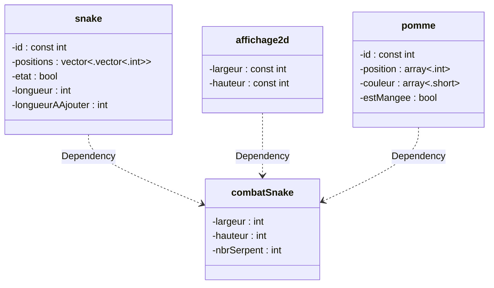

# 08_Snake
## Thème
* Générateur aléatoire   
* Classes et encapsulation   
* Compilation séparée   
* Architecture de code   
* Réutilisabilité du code et des classes   
## But 
Nous souhaitons simuler des serpents allant chercher des pommes. Lors de leurs déplacements, les serpents s’attaquent entre eux.   
La partie se termine lorsque qu’un seul serpent est en jeu.   
### Déroulement
* Dans la console, l’utilisateur est invité à saisir la taille de l’écran et le nbre de serpents.
* Ils sont positionnés aléatoirement avec une longueur initiale de 10 unités.
* Les pommes sont disposées aléatoirement et contiennent une valeur.
* Les serpents ne cherchent que leurs pommes et se déplacent par le plus court chemin (un pas à la fois N, S, W, E). Une fois atteinte, le serpent grandit de la valeur de la pommeet une nouvelle pomme est aléatoirement créée pour lui.
* Si un serpent mord le corps d’un autre (tête sur corps), ce dernier est coupé à cet endroit et 40% de la longueur coupée est ajoutée au serpent attaquant.
* Si un serpent mord un autre par la tête (tête sur tête), le serpent le plus court meurt et 60% de la longueur du serpent tué est ajoutée celle de l’attaquant.
* Les serpents raccourcis sont représentés immédiatement.
* Les serpents rallongés sont représentés au fur et à mesure de leurs déplacements.
* Les chances des serpents sont équilibrées.
* Seules les pommes des serpents en jeu sont représentées.
* La listes des serpents tués est affichées sur la console en cours de partie.
## Contraintes
* Utiliser au mieux tout ce qui a été vu à ce jour.
* Économiser la mémoire au maximum.
* Rendre le code aussi réutilisable que possible.
* L’encapsulation doit être maximale
* La représentation doit correspondre à celle proposée.
* Il doit être possible d’interrompre le programme en fermant la fenêtre graphique.
## Analyse et concept
Schéma de compilation séparée
 ```mermaid
 stateDiagram
     saisie.cpp --> main.cpp
     combatSnakes.cpp --> main.cpp
     snake.cpp --> combatSnakes.cpp
     affichage2d.cpp --> combatSnakes.cpp
     aleatoire.cpp --> combatSnakes.cpp
     pomme.cpp --> combatSnakes.cpp
 ```

