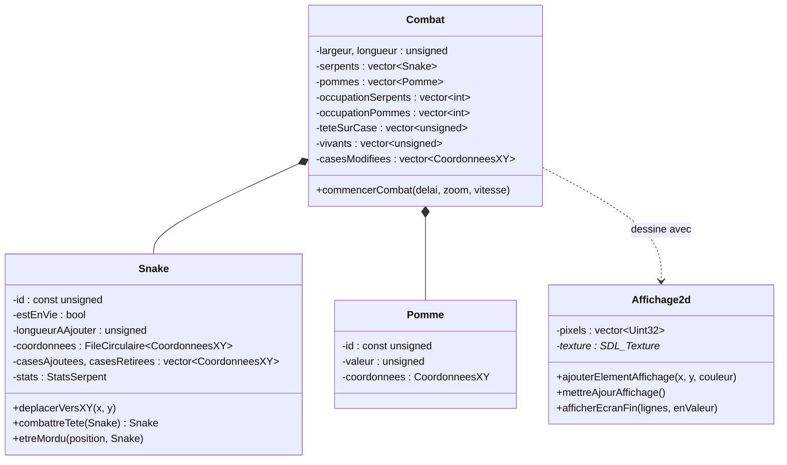

# 08_Snake — Snake battle simulator

Simulation de combat de serpents en C++ avec affichage SDL2 : chaque serpent
court après sa pomme, mord les autres au passage, et la partie s'arrête quand
il n'en reste plus qu'un.

Projet du labo 8 (Delétraz Alexandre, Germano Hugo).

## Prérequis

- Un compilateur C++17 (GCC, Clang ou MSVC)
- CMake ≥ 3.0
- SDL2 (bibliothèque de développement)

| Système         | Installation                                        |
|-----------------|-----------------------------------------------------|
| Debian / Ubuntu | `sudo apt install build-essential cmake libsdl2-dev` |
| Fedora          | `sudo dnf install gcc-c++ cmake SDL2-devel`          |
| macOS           | `brew install cmake sdl2`                            |
| Windows (MSYS2) | `pacman -S mingw-w64-ucrt-x86_64-{gcc,cmake,SDL2}`   |

## Compilation

```sh
cmake -S . -B build
cmake --build build
```

L'exécutable est `build/08_snake` (`build\08_snake.exe` sous Windows).

## Utilisation

Tous les paramètres peuvent être passés en options de lancement. Ceux qui
manquent sont demandés dans la console, ce qui permet aussi de lancer le
programme par un simple double-clic.

```sh
./build/08_snake                          # tout est demandé dans la console
./build/08_snake -l 200 -H 150 -s 20      # aucune question posée
./build/08_snake -l 300 -H 200 -s 200 -d 10 -z 3
./build/08_snake --serpents=50            # seules largeur et hauteur sont demandées
./build/08_snake -l 1200 -H 800 -s 20000 -v 0   # la grosse mêlée, vitesse auto
./build/08_snake --turbo                  # 100 000 serpents, le plus vite possible
```

| Option                | Description                              | Valeurs  | Défaut    |
|-----------------------|------------------------------------------|----------|-----------|
| `-l`, `--largeur N`   | Largeur du terrain, en cases             | 50–1200  | demandée  |
| `-H`, `--hauteur N`   | Hauteur du terrain, en cases             | 50–800   | demandée  |
| `-s`, `--serpents N`  | Nombre de serpents (≤ cases / 4)         | 2–100000 | demandé   |
| `-d`, `--delai N`     | Délai entre deux images, en ms (vitesse) | 0–1000   | 50        |
| `-z`, `--zoom N`      | Taille d'une case à l'écran, en pixels   | 1–16     | 4         |
| `-v`, `--vitesse N`   | Tours de jeu par image, 0 = automatique  | 0–1000   | 1         |
| `-t`, `--turbo`       | Terrain et serpents au maximum, vitesse auto, zoom 1 |  |      |
| `-h`, `--aide`        | Affiche l'aide                           |          |           |

Les formes `--option N` et `--option=N` sont acceptées. Une option inconnue
ou une valeur hors bornes arrête le programme avec un message d'erreur (code
de sortie 1).

La fenêtre fait `largeur × zoom` par `hauteur × zoom` pixels ; si elle ne
tient pas à l'écran, le zoom est réduit automatiquement. Pour accélérer la
partie :

- `-d 0` supprime l'attente entre les images ;
- `-v N` joue N tours par image ;
- `-v 0` (automatique) joue autant de tours que possible pendant chaque image
  et garde ~60 images/s : la partie va aussi vite que la machine le permet ;
- `--turbo` lance directement la plus grosse partie possible (1200×800,
  100 000 serpents) en vitesse automatique. Les options données en plus
  restent prioritaires, par exemple `--turbo -s 20000`. Une partie turbo
  complète dure une dizaine de secondes.

En jeu, **+** / **−** (ou ↑ / ↓) accélèrent ou ralentissent la partie par
paliers (×1, ×2, ×5 … ×1000, puis auto), **ÉCHAP** ou la fermeture de la
fenêtre l'interrompent. Le titre de la fenêtre indique les serpents restants,
le tour en cours et la vitesse.

### Écran de victoire


Quand il ne reste qu'un serpent, le terrain s'assombrit, le vainqueur reste
affiché en vert et la Green Katze Korporation présente son rapport de
simulation, chat vert en pixel art compris (ÉCHAP, ENTRÉE, ESPACE ou la
fermeture de la fenêtre pour quitter). Les statistiques sont aussi écrites
dans la console.

- **Le vainqueur** : longueur finale et maximale, victimes (tête contre
  tête), pommes mangées, morsures données et subies.
- **La partie** : nombre de serpents, terrain, durée, tours joués, pommes
  mangées et morsures au total, serpent le plus long et le plus meurtrier.

Le texte utilise une petite police matricielle 5×7 intégrée au code : pas
besoin de SDL_ttf ni de fichier de police. Sur un petit terrain, la fenêtre
est agrandie pour que le panneau reste lisible, et le panneau se place là où
il cache le moins le vainqueur.

## Règles du jeu

- Les serpents apparaissent à des positions aléatoires avec une longueur
  initiale de 10 cases.
- Chaque serpent a sa propre pomme, placée aléatoirement, avec une valeur.
  Il s'en approche par le plus court chemin, une case à la fois (N, S, E, O) ;
  à chaque pas, l'axe (horizontal ou vertical) est tiré au hasard en fonction
  de la distance restante sur chacun, ce qui le fait suivre à peu près la
  ligne droite vers sa pomme.
- Quand il la mange, il grandit de la valeur de la pomme et une nouvelle
  pomme est créée pour lui.
- **Tête sur corps** : le serpent mordu est coupé à cet endroit et
  l'attaquant gagne 40 % de la longueur coupée.
- **Tête contre tête** : le plus court meurt et le vainqueur gagne 60 % de
  sa longueur.
- Un serpent raccourci l'est immédiatement à l'écran, un serpent qui grandit
  s'allonge au fil de ses déplacements.
- Seules les pommes des serpents encore en vie sont affichées.
- Chaque mise à mort est annoncée dans la console.

## Structure du code

```
main.cpp                 Options de lancement, saisies, lancement du combat
jeu/
  combatSnakes.*         Boucle de jeu, grille d'occupation, affichage
  snake.*                Déplacement, croissance, morsures, mort
  pomme.*                Position et valeur des pommes
outils/
  affichage2d.*          Fenêtre SDL2, tampon de pixels, écran de fin
  police.*               Police matricielle 5x7 (texte sans SDL_ttf)
  saisie.*               Saisie sécurisée d'un entier
  aleatoire.*            Tirage aléatoire
  fileCirculaire.hpp     File circulaire (corps des serpents)
  struct_coordonnees.hpp Coordonnées (x, y)
```


```mermaid
classDiagram
    Combat *-- Snake
    Combat *-- Pomme
    Combat ..> Affichage2d : dessine avec

    class Combat{
        -largeur, longueur : unsigned
        -serpents : vector~Snake~
        -pommes : vector~Pomme~
        -occupationSerpents : vector~int~
        -occupationPommes : vector~int~
        -teteSurCase : vector~unsigned~
        -vivants : vector~unsigned~
        -casesModifiees : vector~CoordonneesXY~
        +commencerCombat(delai, zoom, vitesse)
    }
    class Snake{
        -id : const unsigned
        -estEnVie : bool
        -longueurAAjouter : unsigned
        -coordonnees : FileCirculaire~CoordonneesXY~
        -casesAjoutees, casesRetirees : vector~CoordonneesXY~
        -stats : StatsSerpent
        +deplacerVersXY(x, y)
        +combattreTete(Snake) Snake
        +etreMordu(position, Snake)
    }
    class Pomme{
        -id : const unsigned
        -valeur : unsigned
        -coordonnees : CoordonneesXY
    }
    class Affichage2d{
        -pixels : vector~Uint32~
        -texture : SDL_Texture*
        +ajouterElementAffichage(x, y, couleur)
        +mettreAjourAffichage()
        +afficherEcranFin(lignes, enValeur)
    }
```

### Performances

Le simulateur est pensé pour tenir des dizaines de milliers de serpents :

- **Affichage incrémental** : chaque serpent note les cases qu'il occupe ou
  libère (tête qui avance, queue qui suit, coupure, mort). `Combat` tient une
  grille du nombre de segments et de pommes par case et ne recolore que les
  cases modifiées. `Affichage2d` garde son tampon de pixels et n'envoie à la
  texture SDL que le rectangle modifié.
- **Combats en O(longueur)** : la grille `teteSurCase` indique quel serpent a
  sa tête sur chaque case (au plus un : deux têtes qui se rencontrent se
  battent aussitôt). Un serpent vérifie tête contre tête en une lecture, et
  les morsures en parcourant son propre corps, au lieu d'être comparé à tous
  les autres serpents.
- **Déplacement en O(1)** : le corps est une file circulaire, seules la tête
  et la queue bougent.
- **Serpents morts ignorés** : seule la liste des vivants est parcourue, et
  la mémoire d'un serpent mort est libérée.
- **Cases libres** : trouvées via la grille, sans parcourir les serpents ; un
  terrain plein ne bloque pas le programme.

Mesures indicatives (terrain 1200×800, affichage désactivé, sans délai) :

| Serpents | Avant       | Après, 1 tour/image | Après, `-v 50` | Mémoire |
|----------|-------------|---------------------|----------------|---------|
| 1 000    | ~17 ms/tour | ~1,2 ms/tour        | ~0,2 ms/tour   | 33 Mo   |
| 20 000   | —           | 2–10 ms/tour        | 1–5 ms/tour    |         |
| 100 000  | —           | 3–26 ms/tour        | 1,5–22 ms/tour | 72 Mo   |

Les premiers tours d'une grosse partie sont les plus lourds (hécatombe
initiale), puis tout s'accélère à mesure que les serpents meurent.

## Contexte du labo

Thèmes : générateur aléatoire, classes et encapsulation, compilation séparée,
architecture et réutilisabilité du code.

Contraintes : économiser la mémoire, encapsulation maximale, représentation
conforme à celle demandée, programme interruptible en fermant la fenêtre.
