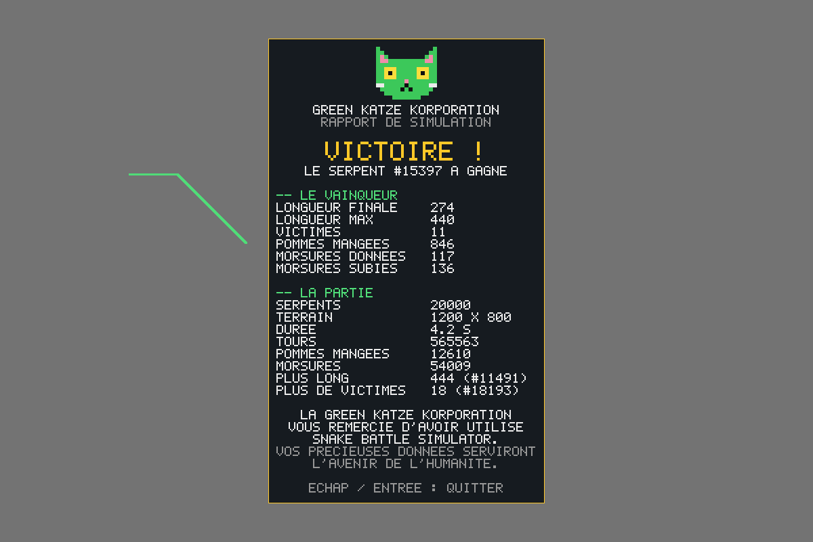
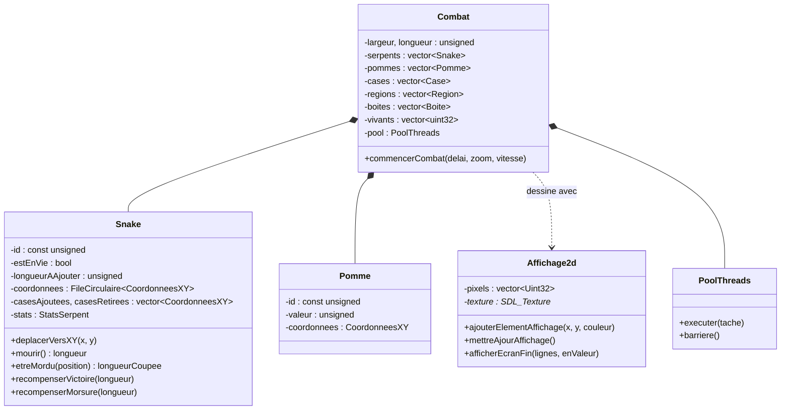

# 08_Snake — Snake battle simulator

Simulation de combat de serpents en C++ avec affichage SDL2 : chaque serpent
court après sa pomme, mord les autres au passage, et la partie s'arrête quand
il n'en reste plus qu'un.

Projet du labo 8 (Delétraz Alexandre, Germano Hugo).

## Prérequis

- Un compilateur C++17 (GCC, Clang ou MSVC)
- CMake ≥ 3.0
- SDL2 (bibliothèque de développement)

| Système         | Installation                                        |
|-----------------|-----------------------------------------------------|
| Debian / Ubuntu | `sudo apt install build-essential cmake libsdl2-dev` |
| Fedora          | `sudo dnf install gcc-c++ cmake SDL2-devel`          |
| macOS           | `brew install cmake sdl2`                            |
| Windows (MSYS2) | `pacman -S mingw-w64-ucrt-x86_64-{gcc,cmake,SDL2}`   |

## Compilation

```sh
cmake -S . -B build
cmake --build build
```

L'exécutable est `build/08_snake` (`build\08_snake.exe` sous Windows).

**Attention au mode Debug** : un dossier `build` déjà configuré garde son
type de compilation. L'extension CMake de VS Code, par exemple, le configure
en `Debug` : sans optimisation, la simulation est **5 à 10 fois plus
lente** (le programme et CMake le signalent). En cas de doute :

```sh
cmake -S . -B build -DCMAKE_BUILD_TYPE=Release
cmake --build build
```

### Version la plus rapide (GCC)

```sh
./pgo.sh            # build-pgo/08_snake
./pgo.sh --natif    # idem, pour le processeur de cette machine seulement
```

`pgo.sh` fait une optimisation guidée par profil, toujours en Release :

1. une version instrumentée est compilée ;
2. elle joue trois parties sans fenêtre, à graines fixes (la mêlée à
   100 000 serpents, une fin de partie sur un thread, une petite partie
   avec les images) et mesure où le programme passe son temps ;
3. GCC recompile en s'en servant ;
4. le script compare avec une compilation Release ordinaire sur une partie
   jamais vue (`--turbo --graine 42`, meilleur de 3) et affiche les deux
   temps. Mesuré sur 4 cœurs : 729 → 654 ms (−10 %).

`--natif` ajoute `-march=native` (quelques % de plus, mais l'exécutable
peut ne pas fonctionner sur un autre ordinateur). Avec Clang, le script
s'arrête : ses options de PGO sont différentes (`CXX=g++ ./pgo.sh`).
Options CMake équivalentes : `-DSNAKE_PGO=GENERER` puis
`-DSNAKE_PGO=UTILISER`, et `-DSNAKE_NATIVE=ON`.

## Utilisation

Tous les paramètres peuvent être passés en options de lancement. Ceux qui
manquent sont demandés dans la console, ce qui permet aussi de lancer le
programme par un simple double-clic.

```sh
./build/08_snake                          # tout est demandé dans la console
./build/08_snake -l 200 -H 150 -s 20      # aucune question posée
./build/08_snake -l 300 -H 200 -s 200 -d 10 -z 3
./build/08_snake --serpents=50            # seules largeur et hauteur sont demandées
./build/08_snake -l 1200 -H 800 -s 20000 -v 0   # la grosse mêlée, vitesse auto
./build/08_snake --turbo                  # 100 000 serpents, le plus vite possible
./build/08_snake --turbo --vsync -v 2     # la même, à regarder (voir plus bas)
```

| Option                | Description                              | Valeurs  | Défaut    |
|-----------------------|------------------------------------------|----------|-----------|
| `-l`, `--largeur N`   | Largeur du terrain, en cases             | 50–1200  | demandée  |
| `-H`, `--hauteur N`   | Hauteur du terrain, en cases             | 50–800   | demandée  |
| `-s`, `--serpents N`  | Nombre de serpents (≤ cases / 4)         | 2–100000 | demandé   |
| `-d`, `--delai N`     | Délai entre deux images, en ms (vitesse) | 0–1000   | 50        |
| `-z`, `--zoom N`      | Taille d'une case à l'écran, en pixels   | 1–16     | 4         |
| `-v`, `--vitesse N`   | Tours de jeu par image, 0 = automatique  | 0–1000   | 1         |
| `-t`, `--turbo`       | Terrain et serpents au maximum, vitesse auto, zoom 1, silencieux | | |
| `-j`, `--threads N`   | Threads de calcul, 0 = cœurs physiques − 1 | 0–256  | 0         |
| `-g`, `--graine N`    | Rejoue exactement la même partie (mêmes `-l -H -s`, tout `-j`) | entier ≥ 0 | au hasard |
| `-q`, `--silencieux`  | N'annonce pas chaque mort                |          |           |
| `-f`, `--fin-auto`    | Statistiques dans la console, pas d'écran de fin à fermer | | |
| `--vsync`             | Images au rythme de l'écran, sans déchirure |        |           |
| `--profil`            | En fin de partie, où le temps a été passé |          |           |
| `-h`, `--aide`        | Affiche l'aide                           |          |           |

Les formes `--option N` et `--option=N` sont acceptées. Une option inconnue
ou une valeur hors bornes arrête le programme avec un message d'erreur (code
de sortie 1).

La fenêtre fait `largeur × zoom` par `hauteur × zoom` pixels ; si elle ne
tient pas à l'écran, le zoom est réduit automatiquement. Pour accélérer la
partie :

- `-d 0` supprime l'attente entre les images ;
- `-v N` joue N tours par image ;
- `-v 0` (automatique) joue autant de tours que possible pendant chaque image
  et garde ~60 images/s : la partie va aussi vite que la machine le permet ;
- `--turbo` lance directement la plus grosse partie possible (1200×800,
  100 000 serpents) en vitesse automatique. Les options données en plus
  restent prioritaires, par exemple `--turbo -s 20000`. Une partie turbo
  complète dure moins d'une seconde sur un portable récent (0,5 s sur un
  i7-1255U) : trop vite pour voir quoi que ce soit.

En jeu, **+** / **−** (ou ↑ / ↓) accélèrent ou ralentissent la partie par
paliers (×1, ×2, ×5 … ×1000, puis auto), **ÉCHAP** ou la fermeture de la
fenêtre l'interrompent. Le titre de la fenêtre indique les serpents restants,
le tour en cours et la vitesse.

### Une partie turbo à regarder

Une partie turbo a deux temps : une mêlée de 100 000 serpents qui ne dure
que ~1 600 tours, puis une longue fin (~320 000 tours) entre une poignée de
survivants. En vitesse automatique, la mêlée tient en une trentaine
d'images. Pour la voir :

```sh
./build/08_snake --turbo --vsync -v 2
```

- `--vsync` cale les images sur l'écran (60 par seconde sur un écran à
  60 Hz) : avec `-v N`, la partie avance de 60 × N tours par seconde, quelle
  que soit la puissance de la machine ;
- `-v 2` : la mêlée dure ~15 s, on voit les serpents foncer vers leurs
  pommes et le terrain se vider ;
- quand il ne reste qu'une centaine de serpents, **+** plusieurs fois
  (×5, ×10 … ×1000, puis auto) pour ne pas attendre 45 minutes la fin.

Durées complètes à vitesse fixe (écran 60 Hz), sans toucher au clavier :

| Commande | Mêlée | Partie entière |
|----------|-------|----------------|
| `--turbo --vsync -v 1`  | ~27 s | ~1 h 30 |
| `--turbo --vsync -v 2`  | ~14 s | ~45 min |
| `--turbo --vsync -v 50` | < 1 s | ~2 min  |
| `--turbo --vsync -v 200` | —    | ~27 s   |

Les chiffres varient d'une graine à l'autre (`--graine N` rejoue la même
partie). Quelle que soit la taille, la fin entre quelques survivants est
longue : `-l 400 -H 300 -s 2000 -z 2 --vsync -v 20` dure de 1 à 4 minutes
selon la graine (70 000 à 260 000 tours).

### Écran de victoire



Quand il ne reste qu'un serpent, le terrain s'assombrit, le vainqueur reste
affiché en vert et la Green Katze Korporation présente son rapport de
simulation, chat vert en pixel art compris (ÉCHAP, ENTRÉE, ESPACE ou la
fermeture de la fenêtre pour quitter). Les statistiques sont aussi écrites
dans la console.

- **Le vainqueur** : longueur finale et maximale, victimes (tête contre
  tête), pommes mangées, morsures données et subies.
- **La partie** : nombre de serpents, terrain, durée, tours joués, pommes
  mangées et morsures au total, serpent le plus long et le plus meurtrier.

Le texte utilise une petite police matricielle 5×7 intégrée au code : pas
besoin de SDL_ttf ni de fichier de police. Sur un petit terrain, la fenêtre
est agrandie pour que le panneau reste lisible, et le panneau se place là où
il cache le moins le vainqueur.

## Règles du jeu

- Les serpents apparaissent à des positions aléatoires avec une longueur
  initiale de 10 cases.
- Chaque serpent a sa propre pomme, placée aléatoirement, avec une valeur.
  Il s'en approche par le plus court chemin, une case à la fois (N, S, E, O) ;
  à chaque pas, l'axe (horizontal ou vertical) est tiré au hasard en fonction
  de la distance restante sur chacun, ce qui le fait suivre à peu près la
  ligne droite vers sa pomme.
- Quand il la mange, il grandit de la valeur de la pomme et une nouvelle
  pomme est créée pour lui.
- Tous les serpents avancent **en même temps**, puis les conflits sont
  réglés.
- **Tête sur corps** : le serpent mordu est coupé à cet endroit et
  l'attaquant gagne 40 % de la longueur coupée.
- **Tête contre tête** : le plus court meurt et le vainqueur gagne 60 % de
  sa longueur (à longueur égale, un tirage). Il y a combat quand plusieurs
  têtes arrivent sur la même case, ou quand une tête arrive sur la case que
  la tête d'un autre vient de quitter. Sans ce second cas, deux têtes ne
  pourraient se rencontrer que si leurs positions avaient la même parité
  (comme les cases d'un damier) : deux serpents de parités différentes ne se
  tueraient jamais et la partie pourrait ne pas finir.
- Un serpent raccourci l'est immédiatement à l'écran, un serpent qui grandit
  s'allonge au fil de ses déplacements.
- Seules les pommes des serpents encore en vie sont affichées.
- Chaque mise à mort est annoncée dans la console.

## Structure du code

```
main.cpp                 Options de lancement, saisies, lancement du combat
jeu/
  combatSnakes.*         Boucle de jeu, grille d'occupation, affichage
  snake.*                Déplacement, croissance, morsures, mort
  pomme.*                Position et valeur des pommes
outils/
  affichage2d.*          Fenêtre SDL2, tampon de pixels, écran de fin
  police.*               Police matricielle 5x7 (texte sans SDL_ttf)
  saisie.*               Saisie sécurisée d'un entier
  aleatoire.*            Tirage aléatoire
  fileCirculaire.hpp     File circulaire (corps des serpents)
  precharger.hpp         Préchargement mémoire (GCC / Clang)
  poolThreads.*          Threads permanents et barrière (calcul parallèle)
  struct_coordonnees.hpp Coordonnées (x, y)
```


```mermaid
classDiagram
    Combat *-- Snake
    Combat *-- Pomme
    Combat ..> Affichage2d : dessine avec
    Combat *-- PoolThreads

    class Combat{
        -largeur, longueur : unsigned
        -serpents : vector~Snake~
        -pommes : vector~Pomme~
        -cases : vector~Case~
        -regions : vector~Region~
        -boites : vector~Boite~
        -vivants : vector~uint32~
        -pool : PoolThreads
        +commencerCombat(delai, zoom, vitesse)
    }
    class Snake{
        -id : const unsigned
        -estEnVie : bool
        -longueurAAjouter : unsigned
        -coordonnees : FileCirculaire~CoordonneesXY~
        -casesAjoutees, casesRetirees : vector~CoordonneesXY~
        -stats : StatsSerpent
        +deplacerVersXY(x, y)
        +mourir() longueur
        +etreMordu(position) longueurCoupee
        +recompenserVictoire(longueur)
        +recompenserMorsure(longueur)
    }
    class Pomme{
        -id : const unsigned
        -valeur : unsigned
        -coordonnees : CoordonneesXY
    }
    class PoolThreads{
        +executer(tache)
        +barriere()
    }
    class Affichage2d{
        -pixels : vector~Uint32~
        -texture : SDL_Texture*
        +ajouterElementAffichage(x, y, couleur)
        +mettreAjourAffichage()
        +afficherEcranFin(lignes, enValeur)
    }
```

### Performances

Le simulateur est pensé pour tenir des dizaines de milliers de serpents :

- **Affichage incrémental** : chaque serpent note les cases qu'il occupe ou
  libère (tête qui avance, queue qui suit, coupure, mort). `Combat` tient une
  grille du nombre de segments et de pommes par case et ne recolore que les
  cases modifiées. `Affichage2d` garde son tampon de pixels et ne recopie
  dans la texture SDL (par `SDL_LockTexture`, la méthode prévue pour les
  textures qui changent souvent) que les bandes d'écran modifiées.
- **Combats sans comparer les serpents deux à deux** : chaque case sait quel
  serpent a sa tête dessus (au plus un : deux têtes qui se rencontrent se
  battent aussitôt), donc tête contre tête se vérifie en une lecture.
- **Morsures détectées à l'arrivée** : les segments d'un corps ne bougent
  jamais, une tête ne peut donc se retrouver sur un corps qu'en y arrivant.
  Chaque case garde le XOR des numéros des segments présents, ce qui donne
  exactement le propriétaire d'un segment seul ; la victime possible est
  prévenue et seuls les serpents menacés parcourent leur corps.
- **Déplacement en O(1)** : le corps est une file circulaire, seules la tête
  et la queue bougent.
- **Serpents morts ignorés** : seule la liste des vivants est parcourue, et
  la mémoire d'un serpent mort est libérée.
- **Cases libres** : trouvées via la grille, sans parcourir les serpents ; un
  terrain plein ne bloque pas le programme.
- **Mémoire proche** : avec des serpents éparpillés sur tout le terrain, le
  temps part surtout en défauts de cache. Les informations d'une case sont
  regroupées dans une seule structure, les petits corps sont rangés dans
  l'objet serpent lui-même, et les cases des prochains serpents à jouer (ou
  à redessiner) sont préchargées à l'avance.
- **Calcul parallèle** : voir ci-dessous.
- **Compilation** : `Release` par défaut et optimisation à l'édition de liens
  (LTO), qui permet d'intégrer les petits accesseurs appelés des millions de
  fois ; la console n'écrit plus ligne par ligne.

Mesures indicatives (terrain 1200×800, affichage désactivé, sans délai) :

| Serpents | Avant       | Après, 1 tour/image | Après, `-v 50` | Mémoire |
|----------|-------------|---------------------|----------------|---------|
| 1 000    | ~17 ms/tour | ~1,2 ms/tour        | ~0,2 ms/tour   | 33 Mo   |
| 20 000   | —           | 2–10 ms/tour        | 1–5 ms/tour    |         |
| 100 000  | —           | 3–26 ms/tour        | 1,5–22 ms/tour | 72 Mo   |

Les premiers tours d'une grosse partie sont les plus lourds (hécatombe
initiale), puis tout s'accélère à mesure que les serpents meurent.

### Calcul parallèle

Un tour est découpé en phases, séparées par des barrières, exécutées par un
groupe de threads permanents (`PoolThreads`) :

| Phase | Réparti par | Travail |
|-------|-------------|---------|
| 1. Déplacement  | serpents | chaque serpent avance ; les changements de cases sont rangés par région de destination |
| 2. Grille       | régions  | chaque région applique les changements qui la concernent, départage les têtes arrivées ensemble, prévient les victimes de morsures possibles |
| 3. Combats      | serpents | chaque serpent sait s'il a perdu un combat |
| 4. Conséquences | serpents | les morts disparaissent, les mordus sont coupés, les repas notés |
| 5. Retraits     | régions  | les cases libérées sont appliquées |
| 6. Résolution   | 1 thread | annonces, récompenses, nouvelles pommes |

- **Aucun verrou** : le terrain est découpé en bandes horizontales, une par
  thread ; une case n'est jamais écrite que par le thread qui traite sa
  bande, et un serpent que par le thread qui le traite. Les messages entre phases sont
  rangés dans une boîte par thread et par région.
- **Déterministe** : chaque serpent tire ses nombres aléatoires dans sa
  propre suite (numéro du serpent, numéro du tour) et la résolution suit
  l'ordre des numéros. Une partie donne exactement le même résultat avec 1,
  2, 3 ou 4 threads, ce qui sert de test.
- **Localité** : les places de départ sont numérotées dans l'ordre du
  terrain, donc des serpents voisins ont des numéros voisins : leurs données
  sont proches en mémoire et chaque thread travaille surtout dans sa région.
- **Vol de travail** : chaque thread a sa part (serpents, régions), toujours
  la même d'une phase et d'un tour à l'autre pour que ses données restent
  dans son cache. Il la prend par tranches dans un compteur qui lui est
  propre ; sa part finie, il vole des tranches dans celles des autres. Sur
  un processeur hybride (cœurs performants et économes, Intel 12e génération
  et suivants, ARM big.LITTLE), les cœurs rapides finissent le travail des
  lents au lieu de les attendre à chaque barrière. Sur un processeur
  uniforme, presque personne ne vole : aucune perte mesurée. (Distribuer
  tout le travail depuis un compteur commun équilibre aussi, mais mélange
  les serpents entre les cœurs à chaque phase : 25 % plus lent sur
  4 cœurs.) Les threads ne sont pas épinglés à des cœurs : sur les
  processeurs hybrides, le système (Thread Director d'Intel) sait mieux où
  les placer.
- **Peu de serpents** : en dessous de 512 serpents, un seul thread joue les
  mêmes phases (se synchroniser coûterait plus que le calcul).
- **Attente adaptative** : un thread qui attend (la barrière, une tâche, les
  autres) tourne d'abord en boucle active, puis cède le processeur, puis
  s'endort. Les durées sont mesurées en temps et non en tours de boucle
  (l'instruction de pause dure de ~10 à ~140 cycles selon le processeur).
  S'il y a plus de threads que de cœurs, la boucle active est presque
  supprimée : un thread qui tourne pour rien priverait de cœur celui qu'il
  attend.
- **Cœurs réellement disponibles** : sous Linux, le nombre de threads par
  défaut tient compte des cœurs autorisés (conteneur, `taskset`), que
  `std::thread::hardware_concurrency()` ignore, et compte les **cœurs
  physiques** : les deux threads matériels d'un même cœur (Hyper-Threading)
  se partagent ses unités de calcul et ses caches, et deux threads de
  calcul sur un même cœur ralentissent plus qu'ils n'aident. Un i7-1255U
  (2 cœurs performants à 2 threads + 8 économes) a 12 processeurs logiques
  mais 10 cœurs : 9 threads de calcul par défaut, au lieu de 11.
- **Architecture** : instruction d'attente adaptée (`pause` sur x86, `isb`
  sur ARM64), données partagées alignées sur la ligne de cache (64 octets,
  128 sur les puces Apple) et compteurs en ordre mémoire séquentiellement
  cohérent pour que l'endormissement soit sûr aussi sur ARM.

Plus de threads que de cœurs (`-j`) est possible mais toujours plus lent ;
le programme prévient. Mesures sur 4 cœurs, 30 000 serpents :

| `-j` | 1 | 4 | 8 | 16 | 64 |
|------|---|---|---|----|----|
| Durée | 2,0 s | 1,2 s | 2,2 s | 2,5 s | 8,7 s |
- Le redessin des cases modifiées est lui aussi réparti par région.
- **Affichage découplé du calcul** : un thread « moteur » enchaîne les lots
  de tours sans s'arrêter ; à la fin de chaque lot, il dépose la liste des
  cases à recolorier (case, couleur). Le thread principal, sur son propre
  cœur, prend la liste, colorie les pixels, envoie l'image et lit le
  clavier. Boîte aux lettres : une seule liste déposée à la fois. En vitesse
  automatique, le moteur n'attend jamais : si l'affichage n'a pas encore
  pris la liste précédente, il continue de jouer et les cases modifiées
  s'accumulent (sans doublons) jusqu'au prochain dépôt. Un affichage lent
  (synchronisation imposée par le système, envoi lent à la carte graphique)
  ne ralentit donc plus le calcul. En vitesse fixe (`-v N`), l'affichage
  donne la cadence. Par défaut, un cœur est laissé à l'affichage (`-j` vaut
  cœurs physiques − 1).
- **Lots d'au moins 16 ms** en vitesse automatique (une image de l'écran
  sur un écran lent) : des lots plus courts sur un écran à 144 Hz ou plus
  multipliaient les images à préparer et à envoyer sans rien montrer de
  plus utile. `--vsync` montre les images au rythme de l'écran, sans
  déchirure, sans ralentir le calcul.
- **Envoi à la carte graphique calibré au démarrage** : aucune méthode n'est
  la plus rapide partout (cela dépend de la carte et du pilote). Trois
  méthodes sont mesurées sur l'image entière, en forçant la carte à finir
  (lecture d'un pixel), et la plus rapide est gardée : bandes verrouillées
  (`SDL_LockTexture`), bandes par `SDL_UpdateTexture`, ou une seule zone.
- **`--profil`** : en fin de partie, temps passé dans le calcul, la
  préparation des images, le coloriage, l'envoi et la présentation, les
  attentes de part et d'autre, et la méthode d'envoi retenue, ainsi que la
  graine, le nombre de tours et de déplacements, le temps de calcul par
  déplacement, et la part des tours joués à plusieurs threads et à un seul
  (fin de partie, moins de 512 serpents). C'est la seule façon fiable de savoir ce qui limite la
  vitesse sur une machine donnée. Pour comparer deux réglages, rejouer la
  même partie : `--turbo --profil --graine 42 -j 4`, puis `-j 8`, etc.
- **Tenir dans le cache** : sur un portable, le cache L3 fait ~12 Mo ; ce
  qui n'y tient pas coûte un aller-retour à la mémoire (~100 ns) à chaque
  accès au hasard. Mesuré en simulant un L3 de 12 Mo (cachegrind), une
  partie `--turbo` : 46,7 → 30,2 millions de défauts de cache (−35 %) :
  - une case du terrain tient en **8 octets** au lieu de 16 (numéros de
    serpent sur 17 bits, la taille d'une tête lue dans le serpent lors d'un
    face-à-face) : 7,7 Mo pour 1200 × 800 au lieu de 15 Mo ;
  - un **résumé de 8 octets par serpent** (case de tête, taille) à côté de
    l'objet `Snake` (~300 octets, 28 Mo pour 100 000 serpents) : les
    combats et les conséquences ne lisent plus l'objet complet que pour les
    morts et les mordus ;
  - **morsures ambiguës** (une tête arrive sur une case où passent plusieurs
    corps : impossible de savoir à qui) : au lieu que tous les serpents
    vérifient tout leur corps case par case, la tuile de 8 × 8 cases est
    marquée, et seuls les serpents assez longs pour l'atteindre depuis leur
    tête vérifient.
- **Pages de 2 Mo** pour la grille du terrain (Linux) : moins de défauts de
  traduction d'adresse pour un tableau lu au hasard.
- **Console** : annoncer 100 000 morts dans un terminal peut coûter plus
  cher que la simulation ; `--turbo` est donc silencieux, et `-q` l'est
  aussi pour les autres parties.

Sur 4 cœurs, une partie `--turbo` complète (100 000 serpents) coûte environ
150 ns de calcul par déplacement de serpent, contre ~285 ns sur un seul
thread et ~275 ns pour la version séquentielle précédente.

## Contexte du labo

Thèmes : générateur aléatoire, classes et encapsulation, compilation séparée,
architecture et réutilisabilité du code.

Contraintes : économiser la mémoire, encapsulation maximale, représentation
conforme à celle demandée, programme interruptible en fermant la fenêtre.
