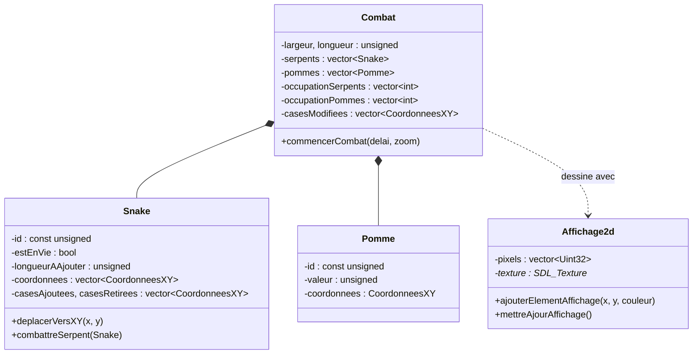

# 08_Snake — Snake battle simulator

Simulation de combat de serpents en C++ avec affichage SDL2 : chaque serpent
court après sa pomme, mord les autres au passage, et la partie s'arrête quand
il n'en reste plus qu'un.

Projet du labo 8 (Delétraz Alexandre, Germano Hugo).

## Prérequis

- Un compilateur C++17 (GCC, Clang ou MSVC)
- CMake ≥ 3.0
- SDL2 (bibliothèque de développement)

| Système         | Installation                                        |
|-----------------|-----------------------------------------------------|
| Debian / Ubuntu | `sudo apt install build-essential cmake libsdl2-dev` |
| Fedora          | `sudo dnf install gcc-c++ cmake SDL2-devel`          |
| macOS           | `brew install cmake sdl2`                            |
| Windows (MSYS2) | `pacman -S mingw-w64-ucrt-x86_64-{gcc,cmake,SDL2}`   |

## Compilation

```sh
cmake -S . -B build
cmake --build build
```

L'exécutable est `build/08_snake` (`build\08_snake.exe` sous Windows).

## Utilisation

Tous les paramètres peuvent être passés en options de lancement. Ceux qui
manquent sont demandés dans la console, ce qui permet aussi de lancer le
programme par un simple double-clic.

```sh
./build/08_snake                          # tout est demandé dans la console
./build/08_snake -l 200 -H 150 -s 20      # aucune question posée
./build/08_snake -l 300 -H 200 -s 200 -d 10 -z 3
./build/08_snake --serpents=50            # seules largeur et hauteur sont demandées
```

| Option                | Description                              | Valeurs  | Défaut    |
|-----------------------|------------------------------------------|----------|-----------|
| `-l`, `--largeur N`   | Largeur du terrain, en cases             | 50–1200  | demandée  |
| `-H`, `--hauteur N`   | Hauteur du terrain, en cases             | 50–800   | demandée  |
| `-s`, `--serpents N`  | Nombre de serpents                       | 2–1000   | demandé   |
| `-d`, `--delai N`     | Délai entre deux images, en ms (vitesse) | 0–1000   | 50        |
| `-z`, `--zoom N`      | Taille d'une case à l'écran, en pixels   | 1–16     | 4         |
| `-h`, `--aide`        | Affiche l'aide                           |          |           |

Les formes `--option N` et `--option=N` sont acceptées. Une option inconnue
ou une valeur hors bornes arrête le programme avec un message d'erreur (code
de sortie 1).

La fenêtre fait `largeur × zoom` par `hauteur × zoom` pixels : avec les
valeurs maximales et le zoom par défaut, elle dépasse n'importe quel écran,
baissez le zoom en conséquence. Fermer la fenêtre interrompt la partie.

## Règles du jeu

- Les serpents apparaissent à des positions aléatoires avec une longueur
  initiale de 10 cases.
- Chaque serpent a sa propre pomme, placée aléatoirement, avec une valeur.
  Il s'en approche par le plus court chemin, une case à la fois (N, S, E, O).
- Quand il la mange, il grandit de la valeur de la pomme et une nouvelle
  pomme est créée pour lui.
- **Tête sur corps** : le serpent mordu est coupé à cet endroit et
  l'attaquant gagne 40 % de la longueur coupée.
- **Tête contre tête** : le plus court meurt et le vainqueur gagne 60 % de
  sa longueur.
- Un serpent raccourci l'est immédiatement à l'écran, un serpent qui grandit
  s'allonge au fil de ses déplacements.
- Seules les pommes des serpents encore en vie sont affichées.
- Chaque mise à mort est annoncée dans la console.

## Structure du code

```
main.cpp                 Options de lancement, saisies, lancement du combat
jeu/
  combatSnakes.*         Boucle de jeu, grille d'occupation, affichage
  snake.*                Déplacement, croissance, morsures, mort
  pomme.*                Position et valeur des pommes
outils/
  affichage2d.*          Fenêtre SDL2 et tampon de pixels
  saisie.*               Saisie sécurisée d'un entier
  aleatoire.*            Tirage aléatoire
  struct_coordonnees.hpp Coordonnées (x, y)
```


```mermaid
classDiagram
    Combat *-- Snake
    Combat *-- Pomme
    Combat ..> Affichage2d : dessine avec

    class Combat{
        -largeur, longueur : unsigned
        -serpents : vector~Snake~
        -pommes : vector~Pomme~
        -occupationSerpents : vector~int~
        -occupationPommes : vector~int~
        -casesModifiees : vector~CoordonneesXY~
        +commencerCombat(delai, zoom)
    }
    class Snake{
        -id : const unsigned
        -estEnVie : bool
        -longueurAAjouter : unsigned
        -coordonnees : vector~CoordonneesXY~
        -casesAjoutees, casesRetirees : vector~CoordonneesXY~
        +deplacerVersXY(x, y)
        +combattreSerpent(Snake)
    }
    class Pomme{
        -id : const unsigned
        -valeur : unsigned
        -coordonnees : CoordonneesXY
    }
    class Affichage2d{
        -pixels : vector~Uint32~
        -texture : SDL_Texture*
        +ajouterElementAffichage(x, y, couleur)
        +mettreAjourAffichage()
    }
```

### Affichage

L'écran n'est pas redessiné entièrement à chaque image :

1. Chaque serpent note les cases qu'il occupe ou libère (avancée de la tête,
   queue qui suit, coupure, mort).
2. `Combat` tient une grille du nombre de segments et de pommes par case, et
   ne recolore que les cases qui ont changé (pomme > serpent > fond).
3. `Affichage2d` conserve son tampon de pixels d'une image à l'autre et
   n'envoie à la texture SDL que le rectangle modifié.

La même grille sert à trouver une case libre pour les nouvelles pommes, sans
parcourir tous les serpents.

## Contexte du labo

Thèmes : générateur aléatoire, classes et encapsulation, compilation séparée,
architecture et réutilisabilité du code.

Contraintes : économiser la mémoire, encapsulation maximale, représentation
conforme à celle demandée, programme interruptible en fermant la fenêtre.
